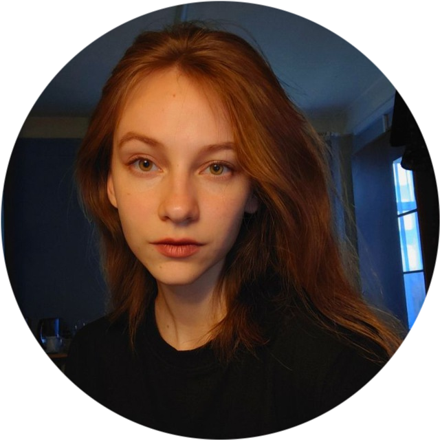
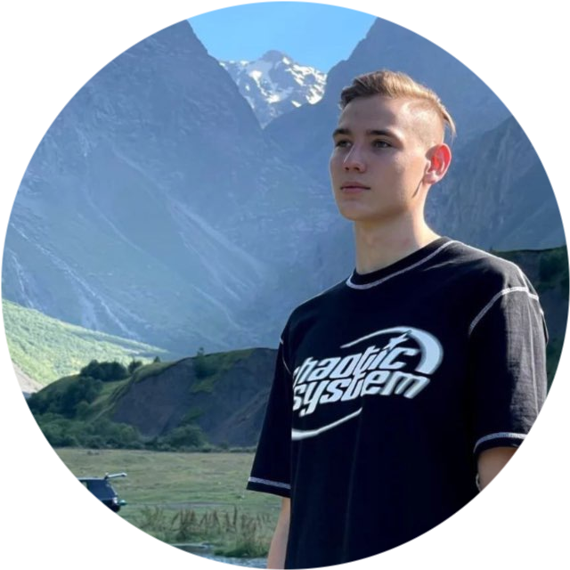

# 
Система обнаружения вторжений

## Какие проблемы решает
Обнаружение DDoS-атак (SYN-flood)

## Стек технологий
<table align="center">
  <tr>
    <th colspan="4"><h3>Модуль ETL</h3></th>
  </tr>
  <tr>
    <td>
<b>WireShark</b>
</td>
    <td>
<b>JSON</b>
</td>
    <td>
<b>Dplyr</b>
</td>
    <td>
<b>API VirusTotal</b>
</td>
  </tr>
</table>

<table align="center">
  <tr>
    <th colspan="3"><h3>Модуль ML</h3></th>
  </tr>
  <tr>
    <td>
<b>Isotree</b>
</td>
    <td>
<b>Dbscan</b>
</td>
    <td>
<b>Caret</b>
</td>
  </tr>
</table>

<table align="center">
  <tr>
    <th colspan="3"><h3>Модуль UI</h3></th>
  </tr>
  <tr>
    <td>
<b>Shiny</b>
</td>
    <td>
<b>HTML</b>
</td>
    <td>
<b>Leaflet</b>
</td>
  </tr>
</table>

## Участники

<table align="center" border="0">
  <tr>
    <td align="center">
Студент БИСО-01-21
<a href="https://github.com/Kasperoid"><b>Иван Устинов</b></a></td>
    <td align="center">
Студент БИСО-01-21
<a href="https://github.com/tyurkina"><b>Ирина Тюркина</b></a></td>
    <td align="center">
Студент БИСО-01-21
<a href="https://github.com/WDarya"><b>Дарья Белая</b></a></td>
    <td align="center">
Студент БИСО-01-21
<a href="https://github.com/desart8104"><b>Артём Десятников</b></a></td>
  </tr>
</table>