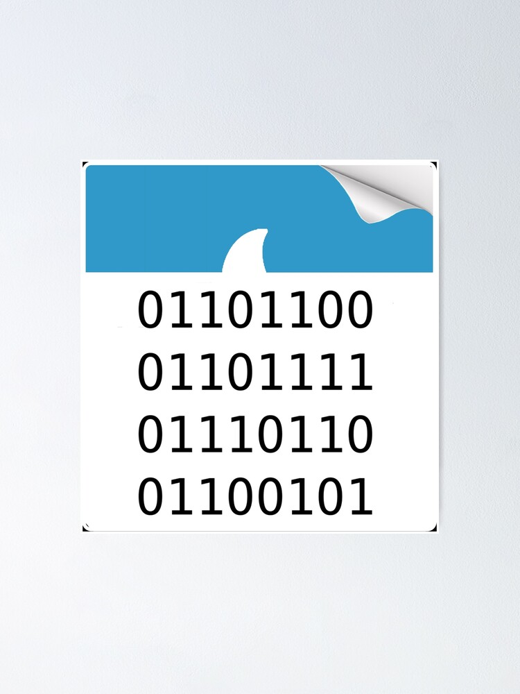

# <span><p align="center">Система обнаружения вторжений</p><p align="center"><p><p align="center"></p></span>

## Какие проблемы решает
Обнаружение DDoS-атак (SYN-flood)

## Стек технологий
<table align="center">
  <tr>
    <th colspan="4"><h3>Модуль ETL</h3></th>
  </tr>
  <tr>
    <td><p align="center"><b>WireShark</b></p></td>
    <td><p align="center"><b>JSON</b></p></td>
    <td><p align="center"><b>Dplyr</b></p></td>
    <td><p align="center"><b>API VirusTotal</b></p></td>
  </tr>
</table>

<table align="center">
  <tr>
    <th colspan="1"><h3>Модуль ML</h3></th>
  </tr>
  <tr>
    <td><p align="center"><b>Isotree</b></p></td>       
  </tr>
</table>

<table align="center">
  <tr>
    <th colspan="4"><h3>Модуль UI</h3></th>
  </tr>
  <tr>
    <td><p align="center"><b>Shiny</b></p></td>
    <td><p align="center"><b>HTML</b></p></td>
    <td><p align="center"><b>Leaflet</b></p></td>
    <td><p align="center"><b>Rmarkdown</b></p></td>
  </tr>
</table>

## Требования
1. Установленный и настроенный [git](https://git-scm.com/book/ru/v2/%D0%92%D0%B2%D0%B5%D0%B4%D0%B5%D0%BD%D0%B8%D0%B5-%D0%9F%D0%B5%D1%80%D0%B2%D0%BE%D0%BD%D0%B0%D1%87%D0%B0%D0%BB%D1%8C%D0%BD%D0%B0%D1%8F-%D0%BD%D0%B0%D1%81%D1%82%D1%80%D0%BE%D0%B9%D0%BA%D0%B0-Git)
2. Установленный [R](https://cran.r-project.org/) (проект собирался на R ≥ 4.1)
3. Установленный [RStudio](https://posit.co/download/rstudio-desktop/)
4. Установленные пакеты:
```r
install.packages(c("shiny", "stringr", "dplyr", "tidyr", "lubridate", "sys", "httr", "countrycode", "readr", "DT", "rmarkdown", "ggplot2", "plotly", "shinybusy", "vroom", "isotree"))
```
5. Получить api key [virusTotal](https://www.virustotal.com/gui/sign-in)
## Как запустить приложение
- Склонировать репозиторий
```
git clone https://github.com/Kasperoid/diva_proj.git
```
- Открыть проект в RStudio
- Создать файл config.R в корне проекта с содержимым:
```r
api_key <- 'your-virus-total-api-key'
```
- Итоговая структура проекта
```
  .
  ├── app.R
  ├── !!!config.R!!!
  ├── diva_proj.Rproj
  ├── readme_img
  |    └── img...
  ├── README.md
  ├── report_conf
  |    └── report_template_html.Rmd
  ├── server.R
  ├── ui.R
  └── www
       └── logo-loader.gif
```
- Запуск приложения осуществляется через RStudio, перейдя в файл app.R и нажав на Run App в правом верхнем углу IDE

> [!IMPORTANT]
> Проверка ip-адресов происходит с помощью VirusTotal API, имеются ограничения:
> - 4 запроса в минуту
> - 500 запросов в день
> - 15.5К запросов с месяц
## Участники

<table align="center" border="0">
  <tr>
    <td align="center"><p>Студент БИСО-01-21</p><a href="https://github.com/Kasperoid"><b>Иван Устинов</b></a></td>
    <td align="center"><p>Студент БИСО-01-21</p><a href="https://github.com/tyurkina"><b>Ирина Тюркина</b></a></td>
    <td align="center"><p>Студент БИСО-01-21</p><a href="https://github.com/WDarya"><b>Дарья Белая</b></a></td>
    <td align="center"><p>Студент БИСО-01-21</p><a href="https://github.com/desart8104"><b>Артём Десятников</b></a></td>
  </tr>
</table>