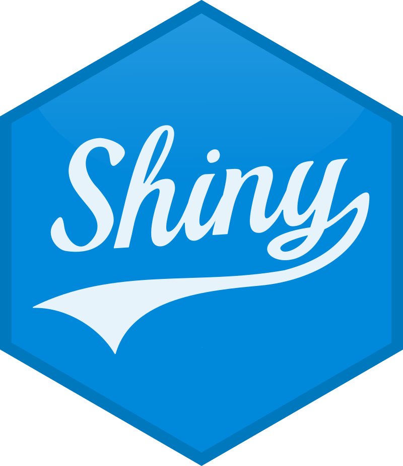

<h1 align="center"> Система обнаружения вторжений {width="140"} </h1>

> Проект, который способен изменить подход к кибербезопасности

## Какие проблемы решает

Обнаружение DDoS-атак (SYN-флуд)

## Стек технологий

  
Модуль ETL

  

  
Сбор данных

  
  
  
  
WireShark

  
  
  
  
JSON

  
  
  

  
Очистка и нормализация

  
  
  
  
Dplyr

  
  
  

  
Обогащение данных

  
  
  
  
Dplyr

  
  
  
  
API VirusTotal

  
  

  
Модуль UI

  

  
Статистический анализ

  
  
  
  
Isotree

  
  
  
  
Dbscan

  
  
  

  
Обнаружение аномалий

  
  
  
  
Caret

  
  

  
Модуль UI

  

  
Визуализация

  
  
  
  
Shiny

  
  
  
  
HTML

  
  
  
  
Leaflet

  
  

## Участники (студенты БИСО-01-21)

  
    
    <a href="https://github.com/Kasperoid" style="color: #3DC3C9; font-size: 16px; font-weight: 600">Устинов Иван</a>
  
  
    
    <a href="https://github.com/tyurkina" style="color: #3DC3C9; font-size: 16px; font-weight: 600">Тюркина Ирина</a>
  
  
    
    <a href="https://github.com/WDarya" style="color: #3DC3C9; font-size: 16px; font-weight: 600">Белая Дарья</a>
  
  
    
    <a href="https://github.com/desart8104" style="color: #3DC3C9; font-size: 16px; font-weight: 600">Десятников Артём</a>
  
